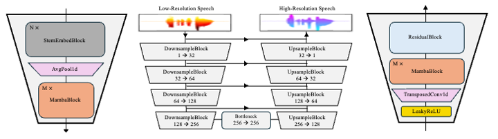

# Wave-U-Mamba

### Yongjoon Lee, Chanwoo Kim

An official documentation of the paper [&lt;Wave-U-Mamba:  An End-To-End Framework For High-Quality And Efficient Speech Super  Resolution>](https://arxiv.org/abs/2409.09337v1).

**Model Architecture**<br>



**Abstract**<br>
Speech Super-Resolution (SSR) is a task of enhancing low-resolution speech signals by restoring missing high-frequency components. Conventional approaches typically reconstruct log-mel features, followed by a vocoder that generates high-resolution speech in the waveform domain. However, as log-mel features lack phase information, this can result in performance degradation during the reconstruction phase. Motivated by recent advances with Selective State Spaces Models (SSMs), we propose a method, referred to as Wave-U-Mamba that directly performs SSR in time domain. In our comparative study, including models such as WSRGlow, NU-Wave 2, and AudioSR, Wave-U-Mamba demonstrates superior performance, achieving the lowest Log-Spectral Distance (LSD) across various low-resolution sampling rates, ranging from 8 kHz to 24 kHz. Additionally, subjective human evaluations, scored using Mean Opinion Score (MOS) reveal that our method produces SSR with natural and human-like quality. Furthermore, Wave-U-Mamba achieves these results while generating high-resolution speech over nine times faster than baseline models on a single A100 GPU, with parameter sizes less than 2% of those in the baseline models.

## Prerequisites
1. Clone this repository and change the directory.
```
git clone https://github.com/infected4098/Wave-U-Mamba.git
cd Wave-U-Mamba
```
3. Install python requirements. Please check [requirements.txt](requirements.txt).
```
pip install -r requirements.txt
```
5. Download config file. Please check [cfgs](cfgs.json).
6. Download the pretrained model. 


## Pretrained Model

You can download the pretrained model we provide. <br/>
[Download pretrained models](https://drive.google.com/file/d/1ljUMQHWil5w8moupWkapqkUOcGNN4x3e/view?usp=sharing)<br/> 

## Inference from wav file


1. Please resample the Low-Resolution audio to make sure your Low-Resolution `.wav` file has sampling rate of 48 kHz.
2. Please run the following command.

```
python inference_wav.py --wav_path [Low-Resolution wav path] \
--output_dir [Folder to save the HR audio wav files] \
--checkpoint_file [Downloaded checkpoint file path] \
--cfgs_path [cfgs file path]
```


## Acknowledgements
We especially thank [Sungbin Lim](https://www.sungbin-lim.net/) for sharing valuable insights and ideas on the draft. We referred to [HiFi-GAN](https://github.com/jik876/hifi-gan), [Mamba](https://github.com/state-spaces/mamba) and many other resources to implement this. 
